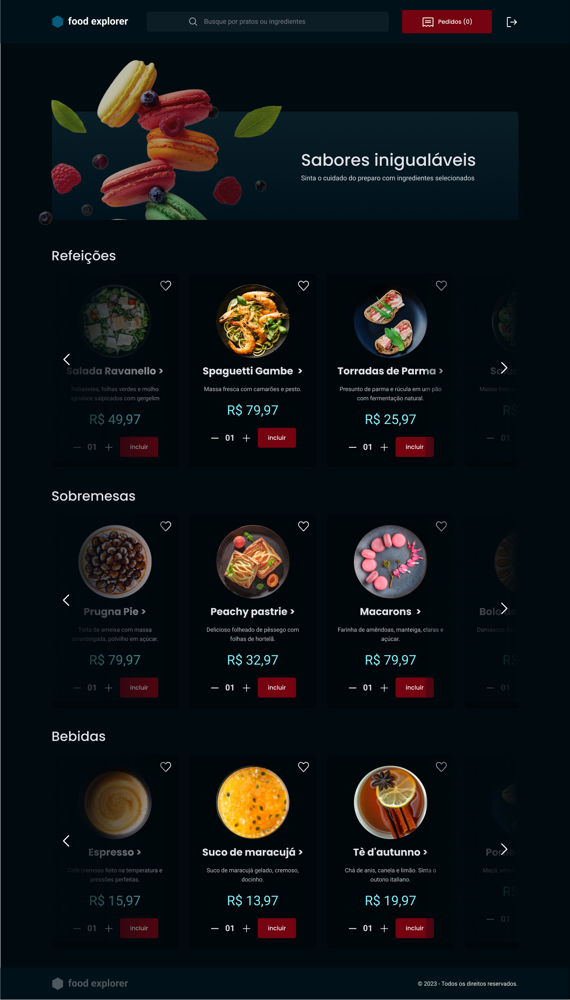

<h1 align="center">  Food Explorer - FrontEnd</h1>

Food Explorer - Frontend

  <a href="#-tecnologias">Tecnologias</a>&nbsp;&nbsp;&nbsp;|&nbsp;&nbsp;&nbsp;
  <a href="#-projeto">Projeto</a>&nbsp;&nbsp;&nbsp; | &nbsp;&nbsp;&nbsp;
  <a href="#-acesso">Acesso</a>&nbsp;&nbsp;&nbsp;|&nbsp;&nbsp;&nbsp;
  <a href="#-deploy">Deploy</a>&nbsp;&nbsp;&nbsp;
  

 

  

## 🚀 Tecnologias

Esse projeto foi desenvolvido com as seguintes tecnologias:

- Figma
- ReactJS
- Axios
- Keen Slider
- React Icons
- Styled Components

## 💻 Projeto

Informações importantes sobre o pojeto:

Ao baixar ou clonar o projeto execute no terminal da aplicação:

- npm i : Para instalar as depêncencias necessárias para funcionamento correto da aplicação.

- npm run dev : Para iniciar a aplicação.

- Acesse no localhost sugerido no terminal.

## 👨‍💻 Acesso

Você precisará executado o backend da aplicação disponível no repositório abaixo:

https://github.com/viniciuszmota/foodexplorerbackend

🙋‍♀️🙋‍♂️ Acesso Administrador:

Email: admin@admin.com  
Senha: 123456

🙋‍♀️🙋‍♂️ Acesso Cliente:

Email: user@email.com  
Senha: 123456

## 👨‍💻 Deploy:

Endereço: https://foodexplorervini.netlify.app/

---

Feito com ♥ by Vinicius Zamprogno, estudante na Rocketseat 👋
